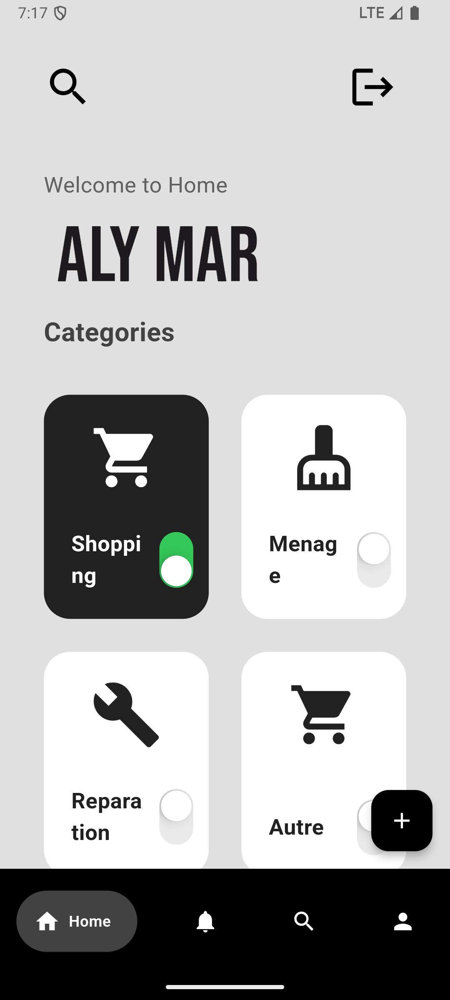
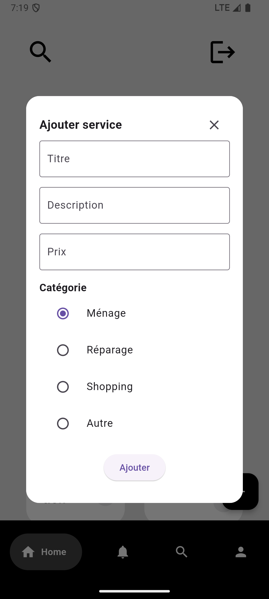
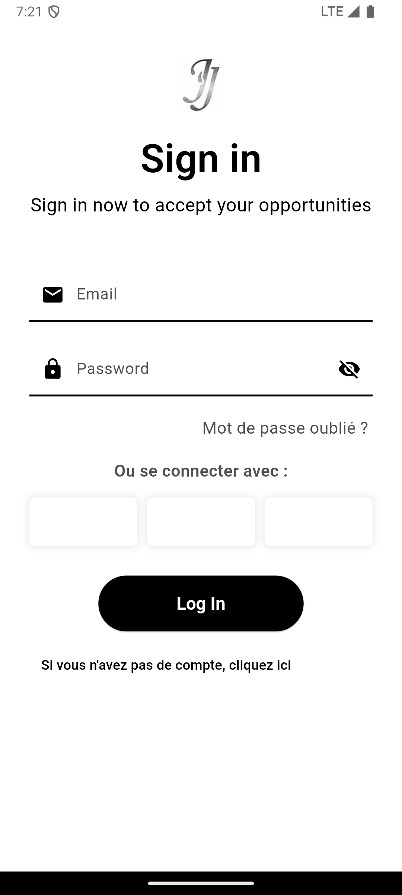

# Jaapalanté

Jaapalanté est une application mobile qui met en relation des utilisateurs avec des jeunes pour des services payants (courses, ménage, réparations). Elle vise à réduire le chômage des jeunes au Sénégal en leur offrant des opportunités de revenus tout en facilitant l’accès à des services fiables.

## Fonctionnalités
- Création de compte et authentification
- Navigation fluide entre les pages : Accueil, Notifications, Profil
- Demande de services variés (courses, réparations, ménage)
- Système de notifications pour suivre les demandes

## Technologies utilisées
- **Flutter** : Développement de l’application mobile
- **Firebase** : Authentification et gestion de base de données

## Captures d’écran

### Page d’accueil  

### Notifications  

### Profil  

### login et register

